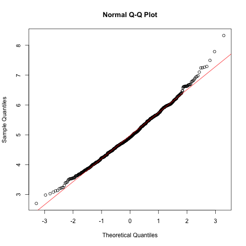

This report is for first part of the course project of the Coursera course "Statistical Inference" which is a part of specialization "Data Science". In this first part, we perform simulation exercises using exponential distributions.

Simulations
-----------

The exponential distribution can be simulated in R with *rexp(n, lambda)* where *lambda* is the rate parameter. The mean of exponential distribution is *1/lambda* and the standard deviation is also *1/lambda*. For these simulations, we set *lambda* to 0.2. We investigate the distribution of averages of 40 exponentials. For this purpose, we perform a thousand or so simulated averages of 40 exponentials.


```r
# R code
set.seed(12345)
lambda <- 0.2

# we need 40 samples and 1000 simulations
num_samples <- 40
num_simulations <- 1000

# doing 1000 simulations
simulated_exponentials <- replicate(num_simulations, rexp(num_samples, lambda))

# Averages of 40 exponentials
means_exponentials <- apply(simulated_exponentials, 2, mean) 
```
Results
-------

**1. Show where the distribution is centered at and compare it to the theoretical center of the distribution.**


```r
# mean of distribution of averages of 40 exponentials
mean(means_exponentials)
```

```
## [1] 4.972
```

```r
# mean from analytical expression
1/lambda
```

```
## [1] 5
```
Therefore, the center of distribution of averages of 40 exponentials is close to the theoretical center of the distribution.

\newpage

**2. Show how variable it is and compare it to the theoretical variance of the distribution.**


```r
# standard deviation of distribution of averages of 40 exponentials
sd(means_exponentials)
```

```
## [1] 0.7716
```

```r
# standard deviation from analytical expression
(1/lambda)/sqrt(num_samples)
```

```
## [1] 0.7906
```
Therefore, the variability in distribution of averages of 40 exponentials is close to the theoretical variance of the distribution.

**3. Show that the distribution is approximately normal.**


```r
# use qqplot and qqline to compare the distribution of averages of 40 exponentials
# to a normal distribution
qqnorm(means_exponentials)
qqline(means_exponentials, col = 2)
```

 

As evident from the Q-Q plot, the distribution of averages of 40 exponentials is very close to a normal distribution.

\newpage

**4. Evaluate the coverage of the confidence interval for 1/lambda: $\bar{X} \pm 1.96 \frac{s}{\sqrt{n}}$**.


```r
# calculate the confidence interval
mean(means_exponentials) + c(-1, 1) * 1.96 * sd(means_exponentials)
```

```
## [1] 3.460 6.484
```
Since, we consider the distribution of averages of exponentials, the standard deviation of this distribution already incorporates the $\sqrt{n}$ term *i.e.* it is the standard error.

The confidence interval is given by [3.460, 6.484].
